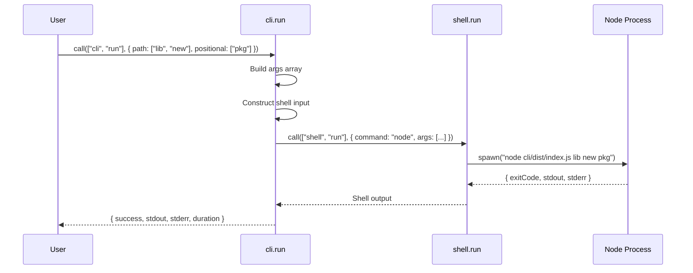

# @mark1russell7/client-cli

[](https://www.npmjs.com/package/@mark1russell7/client-cli)
[](https://opensource.org/licenses/MIT)

> CLI execution wrapper - exposes `cli.run` procedure for running CLI commands programmatically.

## Overview

`@mark1russell7/client-cli` is a CLI wrapper package that exposes the mark CLI tool as RPC procedures. It enables programmatic execution of mark CLI commands through the client procedure system, using `client-shell` for command execution.

This package follows the **CLI Wrapper Pattern** - a single generalized procedure that wraps a CLI tool, taking path-based input to construct commands dynamically.

## Architecture

```mermaid
graph TB
    A[client-cli] -->|uses| B[client-shell]
    A -->|depends on| C[@mark1russell7/client]
    A -->|validates with| D[zod]

    E[cli.run procedure] -->|builds command| F[node cli/dist/index.js]
    E -->|calls| G[shell.run]
    G -->|executes| F

    style A fill:#e1f5ff
    style B fill:#ffe1e1
    style E fill:#e1ffe1
```

### Data Flow



## Installation

```bash
# Using pnpm (recommended)
pnpm add @mark1russell7/client-cli

# Using npm
npm install @mark1russell7/client-cli

# Using yarn
yarn add @mark1russell7/client-cli
```

## API Reference

### Procedures

#### `cli.run`

Run a mark CLI command programmatically.

**Path:** `["cli", "run"]`

**Input Schema:**
```typescript
interface CliRunInput {
  /** Procedure path to call, e.g. ["lib", "new"] for "mark lib new" */
  path: string[];

  /** Named arguments as key-value pairs, e.g. { name: "foo" } -> "--name foo" */
  args?: Record<string, string | number | boolean>;

  /** Positional arguments after the path */
  positional?: string[];

  /** Working directory */
  cwd?: string;

  /** Timeout in milliseconds */
  timeout?: number;
}
```

**Output Schema:**
```typescript
interface CliRunOutput {
  /** Exit code of the command */
  exitCode: number;

  /** Standard output */
  stdout: string;

  /** Standard error */
  stderr: string;

  /** Whether command succeeded (exit code 0) */
  success: boolean;

  /** Duration in milliseconds */
  duration: number;
}
```

### Types & Schemas

```typescript
// Input validation schema
export const CliRunInputSchema: z.ZodObject<{
  path: z.ZodArray<z.ZodString>;
  args: z.ZodOptional<z.ZodRecord<z.ZodString, z.ZodUnion<[z.ZodString, z.ZodNumber, z.ZodBoolean]>>>;
  positional: z.ZodOptional<z.ZodArray<z.ZodString>>;
  cwd: z.ZodOptional<z.ZodString>;
  timeout: z.ZodOptional<z.ZodNumber>;
}>;

// Type inference
export type CliRunInput = z.infer<typeof CliRunInputSchema>;
export type { CliRunOutput };
```

### Functions

```typescript
// Low-level procedure function
export async function cliRun(
  input: CliRunInput,
  ctx: ProcedureContext
): Promise<CliRunOutput>;

// Registration function
export function registerCliProcedures(): void;
```

## Usage Examples

### Basic Command Execution

```typescript
import { Client } from "@mark1russell7/client";
import "@mark1russell7/client-cli/register.js";

const client = new Client();

// Equivalent to: mark lib new my-package
const result = await client.call(["cli", "run"], {
  path: ["lib", "new"],
  positional: ["my-package"],
});

if (result.success) {
  console.log("Package created:", result.stdout);
} else {
  console.error("Error:", result.stderr);
}
```

### Named Arguments

```typescript
// Equivalent to: mark procedure new fs.read --description "Read a file"
await client.call(["cli", "run"], {
  path: ["procedure", "new"],
  positional: ["fs.read"],
  args: {
    description: "Read a file"
  },
});
```

### Boolean Flags

```typescript
// Equivalent to: mark lib refresh --force --dry-run
await client.call(["cli", "run"], {
  path: ["lib", "refresh"],
  args: {
    force: true,
    dryRun: true, // becomes --dryRun
  },
});
```

### Custom Working Directory

```typescript
// Run command in specific directory
const result = await client.call(["cli", "run"], {
  path: ["lib", "scan"],
  cwd: "/path/to/workspace",
});
```

### Timeout Handling

```typescript
// Set timeout for long-running commands
const result = await client.call(["cli", "run"], {
  path: ["lib", "install"],
  timeout: 300000, // 5 minutes
});
```

### Error Handling

```typescript
try {
  const result = await client.call(["cli", "run"], {
    path: ["lib", "new"],
    positional: ["my-package"],
  });

  if (!result.success) {
    console.error(`Command failed with exit code ${result.exitCode}`);
    console.error(`stderr: ${result.stderr}`);
  }
} catch (error) {
  console.error("Procedure call failed:", error);
}
```

## Configuration

### Package.json Client Field

```json
{
  "client": {
    "procedures": "./dist/register.js"
  }
}
```

The `client.procedures` field tells the client system where to find procedure registrations. When this package is installed, procedures are automatically registered via the postinstall hook:

```json
{
  "scripts": {
    "postinstall": "client announce"
  }
}
```

### Build Configuration

TypeScript compilation uses project references for efficient builds:

```bash
# Build the package
pnpm build

# Type check without emitting
pnpm typecheck

# Clean build artifacts
pnpm clean
```

## Dependencies

### Runtime Dependencies

```mermaid
graph LR
    A[@mark1russell7/client-cli] --> B[@mark1russell7/client]
    A --> C[@mark1russell7/client-shell]
    A --> D[zod]

    B -.->|provides| E[Client & Procedure System]
    C -.->|provides| F[shell.run procedure]
    D -.->|provides| G[Schema Validation]

    style A fill:#e1f5ff
    style B fill:#ffe1e1
    style C fill:#ffe1e1
    style D fill:#fff4e1
```

- **`@mark1russell7/client`** - Core client library providing the procedure system, `createProcedure`, and `registerProcedures` functions.
- **`@mark1russell7/client-shell`** - Generic shell execution wrapper, provides `shell.run` procedure for spawning processes.
- **`zod`** - Schema validation library for input validation.

### Development Dependencies

- **`@mark1russell7/cue`** - CUE configuration system for package management.
- **`@types/node`** - TypeScript definitions for Node.js.
- **`typescript`** - TypeScript compiler.

## Integration with Ecosystem

### Used By

This package is typically imported by **bundle packages** like `bundle-dev`:

```typescript
// bundle-dev/src/register.ts
import "@mark1russell7/client-cli/register.js";
import "@mark1russell7/client-pnpm/register.js";
import "@mark1russell7/client-git/register.js";
// ... more imports
```

### CLI Wrapper Pattern

`client-cli` follows the ecosystem's **CLI Wrapper Pattern**:

1. **Single Generalized Procedure** - One `cli.run` procedure handles all CLI commands
2. **Path-Based Input** - Commands are constructed from `path` array
3. **Shell Delegation** - Uses `client-shell` for actual execution
4. **Consistent Output** - Returns standardized `{ exitCode, stdout, stderr, success, duration }`

This pattern is also used by:
- `client-pnpm` - PNPM package manager wrapper
- `client-git` - Git operations wrapper (note: uses direct git commands, not shell)

### Command Construction Logic

The procedure builds commands by:

1. **Path → Subcommands**: `["lib", "new"]` → `"lib new"`
2. **Positional Arguments**: Added after path
3. **Named Arguments**: Converted to flags
   - Boolean `true` → `--flag`
   - Boolean `false` → omitted
   - String/Number → `--flag value`

Example:
```typescript
{
  path: ["lib", "new"],
  positional: ["my-pkg"],
  args: { description: "My package", force: true }
}
// Becomes: node cli/dist/index.js lib new my-pkg --description "My package" --force
```

## Advanced Usage

### Direct Function Import

Instead of using the client system, you can import the procedure function directly:

```typescript
import { cliRun } from "@mark1russell7/client-cli";
import { Client } from "@mark1russell7/client";

const client = new Client();

const result = await cliRun(
  {
    path: ["lib", "new"],
    positional: ["my-package"],
  },
  { client } as ProcedureContext
);
```

### Custom Registration

Register procedures under a different namespace:

```typescript
import { createProcedure, registerProcedures } from "@mark1russell7/client";
import { cliRun, CliRunInputSchema } from "@mark1russell7/client-cli";

const customCliProcedure = createProcedure()
  .path(["custom", "cli"])
  .input(CliRunInputSchema)
  .handler(cliRun)
  .build();

registerProcedures([customCliProcedure]);
```

## Performance Considerations

- **Process Spawning Overhead**: Each call spawns a new Node.js process running the CLI
- **Serialization Cost**: Arguments are serialized to command-line strings
- **Timeout Defaults**: Use appropriate timeouts for long-running commands
- **Caching**: Consider caching results for idempotent commands

## Troubleshooting

### Command Not Found

If you get "command not found" errors:

1. Verify the CLI is built: `pnpm --filter cli build`
2. Check the command path exists: `ls cli/dist/index.js`
3. Ensure working directory is correct (defaults to `process.cwd()`)

### Timeout Errors

For commands that take longer than 2 minutes:

```typescript
await client.call(["cli", "run"], {
  path: ["lib", "install"],
  timeout: 600000, // 10 minutes
});
```

### Exit Code Non-Zero

Check both `success` flag and `stderr`:

```typescript
const result = await client.call(["cli", "run"], { ... });
if (!result.success) {
  console.error(`Exit code: ${result.exitCode}`);
  console.error(`Error output: ${result.stderr}`);
}
```

## License

MIT

## Related Packages

- [@mark1russell7/client](https://github.com/mark1russell7/client) - Core client library
- [@mark1russell7/client-shell](https://github.com/mark1russell7/client-shell) - Shell execution wrapper
- [@mark1russell7/client-pnpm](https://github.com/mark1russell7/client-pnpm) - PNPM wrapper
- [@mark1russell7/client-git](https://github.com/mark1russell7/client-git) - Git operations wrapper
- [@mark1russell7/bundle-dev](https://github.com/mark1russell7/bundle-dev) - Development bundle
